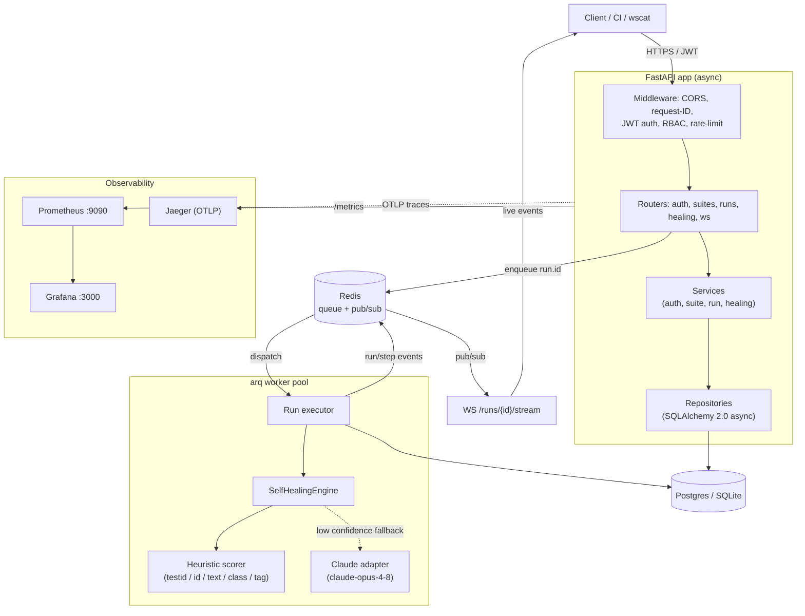

# Aegis

> A distributed, AI-powered self-healing test-orchestration platform.

[](https://www.python.org/)
[](https://fastapi.tiangolo.com/)
[](#license)
[](https://github.com/rohit-saxena/aegis-platform/actions/workflows/ci.yml)
[](#testing)
[](https://docs.astral.sh/ruff/)
[](https://mypy-lang.org/)

---

Aegis registers UI test suites, fans their runs out across an asynchronous worker pool, and streams
results back live. When a UI locator *drifts* — the element moved, its `id` changed, the markup was
refactored — Aegis doesn't just fail the step: a **self-healing engine** captures a DOM snapshot,
scores every candidate element heuristically, and (optionally) consults **Claude** to recover a robust
selector, auto-applying it when confidence is high enough and flagging it for human review when it
isn't. The domain is test orchestration; the substance is a production-shaped distributed Python
backend — async API, hexagonal layering, a queue-backed worker tier, live WebSocket events, and
first-class observability.

> Designed to run end to end on **zero external infrastructure** (SQLite + an in-process fake Redis),
> then scale up to Postgres, Redis-backed `arq` workers, Prometheus, Grafana, and Jaeger by flipping
> environment variables — no code changes.

## Why this project is interesting

A deliberate tour of the competencies a senior backend / platform engineer is expected to demonstrate,
each mapped to where it lives in the code:

- **Async all the way down** — FastAPI + SQLAlchemy 2.0 async + `redis.asyncio`. No blocking calls on
  the request path; the worker tier is `async` too.
- **Hexagonal / ports-and-adapters architecture** — clean separation of `api -> services -> repositories -> db`,
  with the healing engine behind a `HealingLLM` protocol so the Claude adapter, a null adapter, and the
  heuristic strategy are all swappable. Settings select the implementation, not the call sites.
- **Distributed workers & idempotency** — runs are dispatched to an `arq`/Redis worker pool
  (`InlineDispatcher` when no Redis is configured), and run creation honours an `Idempotency-Key` so a
  retried `POST` never double-executes.
- **Resilience patterns** — timeouts, retries with backoff, and a circuit breaker (`core/resilience.py`)
  guard the LLM call; pub/sub and metrics failures are best-effort and never abort a run.
- **Observability as a feature** — Prometheus metrics (`/metrics`), structured JSON logging via
  `structlog`, request-ID propagation, and optional OpenTelemetry tracing to an OTLP collector (Jaeger).
- **Security done properly** — Argon2 password hashing, JWT access/refresh tokens, and role-based access
  control (`ADMIN`/`ENGINEER`/`VIEWER`) enforced by a dependency factory.
- **Real-time delivery** — a WebSocket endpoint relays run/step events from a Redis pub/sub channel, so
  clients watch healing happen as it happens.
- **Containerization & orchestration** — multi-stage Docker image, a one-command `docker compose` stack,
  and Kubernetes manifests plus a Helm chart for deployment.
- **CI/CD & quality gates** — `ruff`, `mypy --strict`, `bandit`, and a pytest suite with an **80% coverage
  floor** enforced in `pyproject.toml`.
- **Testability without infrastructure** — the simulated executor and fake Redis make the *entire* code
  path (DB, healing, metrics, events) exercisable in CI with no containers.

## Architecture



Run creation returns `202 Accepted` immediately and enqueues `run.id`; the worker opens its own DB
session, executes each case step by step, heals drifted locators, persists `StepResult` /
`HealingEvent` rows, and publishes events that the WebSocket relays to subscribers.

## Self-healing, end to end

When a step's locator no longer matches the page, Aegis treats it as a recoverable signal rather than a
hard failure:

1. **Detect drift.** A locator is considered *stable* if it survives DOM change — a `[data-testid=…]`,
   a class, or a stable attribute (`name`, `aria-label`, `placeholder`, `role`, `type`). A locator
   pinned to a brittle `#id` or a pure structural path (`nav > ul:nth-child(5)`) has **drifted**.
2. **Snapshot the DOM.** The executor captures the page's current markup and a `snapshot_hash` for
   auditability, then hands the broken selector + snapshot to the `SelfHealingEngine`.
3. **Score heuristically (fast, free, deterministic).** Every candidate element is scored against the
   broken selector's intent using weighted signals that mirror real-world locator robustness:

   | Signal        | Weight | Rationale                                              |
   | ------------- | -----: | ------------------------------------------------------ |
   | `data-testid` |   0.60 | Most stable signal — enough alone to clear threshold   |
   | `id`          |   0.18 | Strong but more change-prone than a test-id            |
   | visible text  |   0.10 | Fuzzy `SequenceMatcher` ratio against target text      |
   | class overlap |   0.07 | Jaccard similarity of class sets                       |
   | tag           |   0.03 | Weak structural hint                                   |
   | other attrs   |   0.02 | `name`/`aria-label`/`placeholder`/`role`/`type`        |

   The best candidate's stable selector is synthesised and returned as a `HEURISTIC` proposal.
4. **Fall back to Claude (optional).** If heuristic confidence is below `AEGIS_HEALING_MIN_CONFIDENCE`
   (default `0.6`) **and** an Anthropic API key is configured, the engine asks `claude-opus-4-8` for a
   selector. Without a key, a null adapter keeps the engine heuristic-only — the platform still runs.
5. **HYBRID agreement.** When the heuristic and Claude independently agree on the *same* locator,
   confidence is boosted (+0.1, capped at 1.0) and the proposal is tagged `HYBRID`; otherwise the
   higher-confidence proposal wins.
6. **Auto-apply vs. human review.** A proposal at or above the confidence threshold is auto-accepted and
   the step is marked `HEALED`; below threshold it heals but is flagged (`accepted = null`) for a human to
   accept or reject via `POST /healing/{event_id}/review`. A drifted selector with *no* recoverable
   signal cannot heal and the step fails honestly. Every attempt is recorded to Prometheus
   (`HEALING_ATTEMPTS`, `HEALING_CONFIDENCE`).

The seeded demo suite is built to show all three outcomes: stable locators pass, a brittle `#id` heals
with high confidence, a text-locator drift heals at low confidence (review), and a purely structural
locator fails.

## Quickstart — run in 60 seconds, zero infrastructure

No Postgres, no Redis, no Docker. Defaults to SQLite + an in-process fake cache.

```bash
git clone https://github.com/rohit-saxena/aegis-platform.git
cd aegis-platform

python -m venv .venv
# macOS/Linux:
source .venv/bin/activate
# Windows (PowerShell):
# .venv\Scripts\Activate.ps1

pip install -e ".[dev]"

aegis seed                 # creates admin@aegis.dev / aegis-admin-pw + a demo suite
aegis serve --reload       # or: uvicorn aegis.main:app --reload
```

Open the interactive docs at **http://localhost:8000/docs**.

Seeded credentials: **`admin@aegis.dev`** / **`aegis-admin-pw`**.

### Drive it with curl

```bash
BASE=http://localhost:8000/api/v1

# 1) (Optional) register a new engineer — or just use the seeded admin below.
curl -s -X POST "$BASE/auth/register" \
  -H 'Content-Type: application/json' \
  -d '{"email":"qa@aegis.dev","password":"super-secret-pw","full_name":"QA Bot","role":"engineer"}'

# 2) Log in. NOTE: /auth/login is an OAuth2 password flow — it is FORM-ENCODED
#    (application/x-www-form-urlencoded) with fields `username` and `password`,
#    NOT JSON.
TOKEN=$(curl -s -X POST "$BASE/auth/login" \
  -H 'Content-Type: application/x-www-form-urlencoded' \
  -d 'username=admin@aegis.dev&password=aegis-admin-pw' | python -c 'import sys,json;print(json.load(sys.stdin)["access_token"])')

# 3) Find the seeded demo suite (slug: aegis-demo) and grab its id.
SUITE_ID=$(curl -s "$BASE/suites" -H "Authorization: Bearer $TOKEN" \
  | python -c 'import sys,json;print(json.load(sys.stdin)["items"][0]["id"])')

# 4) Trigger a run. The Idempotency-Key header makes a retried POST a no-op.
RUN_ID=$(curl -s -X POST "$BASE/suites/$SUITE_ID/runs" \
  -H "Authorization: Bearer $TOKEN" \
  -H 'Content-Type: application/json' \
  -H 'Idempotency-Key: demo-run-001' \
  -d '{"trigger":"manual"}' | python -c 'import sys,json;print(json.load(sys.stdin)["id"])')

# 5) Fetch the run detail (step results) and its healing events.
curl -s "$BASE/runs/$RUN_ID" -H "Authorization: Bearer $TOKEN"
curl -s "$BASE/runs/$RUN_ID/healing" -H "Authorization: Bearer $TOKEN"
```

### Watch a run heal, live

The WebSocket stream takes the JWT as a `token` query parameter (browsers/CLIs can't set Authorization
headers on WS handshakes ergonomically). In a non-production environment the token is optional.

```bash
# npm i -g wscat
wscat -c "ws://localhost:8000/api/v1/runs/$RUN_ID/stream?token=$TOKEN"
# -> {"event":"run.started", ...}
# -> {"event":"step.completed","status":"healed","healed_selector":"[data-testid=\"submit\"]", ...}
# -> {"event":"run.finished","status":"failed","passed":3,"failed":1,"healed":2, ...}
```

## Run the full stack

Brings up Postgres, Redis, the API, an `arq` worker, Prometheus, Grafana, and Jaeger:

```bash
docker compose -f docker/docker-compose.yml up --build
```

| Service    | URL                       | Notes                                  |
| ---------- | ------------------------- | -------------------------------------- |
| API        | http://localhost:8000     | `/docs`, `/healthz`, `/readyz`         |
| Prometheus | http://localhost:9090     | scrapes the API `/metrics` endpoint    |
| Grafana    | http://localhost:3000     | preloaded Aegis dashboard              |
| Jaeger     | http://localhost:16686    | distributed traces (set tracing on)    |

The worker runs `arq aegis.workers.arq_worker.WorkerSettings`. Once a `AEGIS_REDIS_URL` is present, run
dispatch automatically switches from the inline executor to the Redis-backed `arq` pool — no code change.

## API overview

All routes are under the `/api/v1` prefix. Authenticated routes expect `Authorization: Bearer <token>`.
Write operations require the `ENGINEER` role (admins always pass).

| Method      | Path                          | Auth         | Description                                          |
| ----------- | ----------------------------- | ------------ | ---------------------------------------------------- |
| `POST`      | `/auth/register`              | public       | Create a user account                                |
| `POST`      | `/auth/login`                 | public       | OAuth2 password flow (**form-encoded**) → tokens     |
| `POST`      | `/auth/refresh`               | public       | Exchange a refresh token for new tokens              |
| `GET`       | `/auth/me`                    | user         | Current authenticated user                           |
| `POST`      | `/suites`                     | engineer     | Create a test suite (with cases)                     |
| `GET`       | `/suites`                     | user         | List suites (paginated)                              |
| `GET`       | `/suites/{suite_id}`          | user         | Suite detail (cases + steps)                         |
| `PATCH`     | `/suites/{suite_id}`          | engineer     | Update a suite                                       |
| `DELETE`    | `/suites/{suite_id}`          | engineer     | Delete a suite                                       |
| `POST`      | `/suites/{suite_id}/cases`    | engineer     | Add a test case to a suite                           |
| `POST`      | `/suites/{suite_id}/runs`     | engineer     | Trigger a run (`Idempotency-Key` header) → `202`     |
| `GET`       | `/runs`                       | user         | List runs (filter by `suite_id`)                     |
| `GET`       | `/runs/{run_id}`              | user         | Run detail (step results)                            |
| `POST`      | `/runs/{run_id}/cancel`       | engineer     | Cancel a queued/running run                          |
| `GET`       | `/runs/{run_id}/healing`      | user         | Healing events for a run                             |
| `POST`      | `/healing/{event_id}/review`  | engineer     | Accept/reject a low-confidence heal                  |
| `WS`        | `/runs/{run_id}/stream?token=`| user (query) | Live run/step events via Redis pub/sub               |
| `GET`       | `/health`                     | public       | Service metadata                                     |

Infra endpoints live on the root app (outside `/api/v1`): `GET /healthz` (liveness), `GET /readyz`
(readiness — checks DB + cache), `GET /metrics` (Prometheus), `GET /` (root), `GET /docs`, `GET /redoc`.

Errors use a consistent envelope:

```json
{ "error": { "code": "not_found", "message": "Suite not found.", "details": null } }
```

## Observability

- **Metrics** — `GET /metrics` exposes Prometheus counters/histograms: request latency, active runs, run
  outcomes, worker tasks, healing attempts by `(strategy, outcome)`, and a healing-confidence histogram.
- **Dashboards** — a preloaded Grafana dashboard (in the compose stack) visualises run throughput,
  pass/heal/fail mix, and healing confidence distribution.
- **Tracing** — set `AEGIS_TRACING_ENABLED=true` (and install the `otel` extra) to export OpenTelemetry
  spans for FastAPI and SQLAlchemy to the OTLP endpoint (`AEGIS_OTLP_ENDPOINT`, default `:4317`), viewable
  in Jaeger.
- **Logging** — `structlog` with request-ID correlation; set `AEGIS_LOG_JSON=true` for machine-readable logs.

## Testing

```bash
pytest                       # full suite, runs entirely on SQLite + fake Redis (no containers)
pytest -m unit               # fast, isolated tests
pytest -m integration        # API/db stack tests
ruff check . && mypy src     # lint + strict type-check
```

- **Coverage gate: 80%** (`fail_under = 80` in `pyproject.toml`), with branch coverage and
  term + XML reports.
- **No testcontainers needed** — the simulated browser executor and in-process fake cache exercise the
  real DB, healing, metrics, and event paths locally and in CI.
- `pytest-asyncio` in `auto` mode; markers `unit` and `integration` are enforced (`--strict-markers`).

## Project layout

```
aegis-platform/
├── src/aegis/
│   ├── api/                 # FastAPI layer
│   │   ├── deps.py          # DB session, auth, RBAC, pagination, rate-limit, Idempotency-Key
│   │   ├── errors.py        # exception handlers → error envelope
│   │   ├── router.py        # aggregate v1 router
│   │   └── v1/              # auth, suites, runs, healing, ws, health routers
│   ├── cache/               # redis.asyncio with a fakeredis fallback
│   ├── core/                # config, security, exceptions, logging, metrics,
│   │                        #   resilience, pagination, idempotency, observability
│   ├── db/                  # Base/mixins, async engine + session, SQLAlchemy models
│   ├── domain/              # enums + Pydantic v2 schemas (DTOs)
│   ├── healing/             # dom parsing, heuristic strategies, LLM adapter, engine
│   ├── repositories/        # BaseRepository + user/suite/run/healing repos
│   ├── services/            # auth, suite, run, healing application services
│   ├── workers/             # executor, dispatch, arq tasks + worker settings
│   ├── main.py              # app factory, lifespan, infra endpoints
│   └── cli.py               # `aegis` Typer CLI: version | serve | create-user | seed
├── tests/
├── docker/                  # Dockerfile + docker-compose.yml (Postgres, Redis, Prometheus, Grafana, Jaeger)
├── deploy/
│   ├── helm/aegis/          # Helm chart
│   └── k8s/                 # raw Kubernetes manifests
├── docs/adr/                # architecture decision records
└── pyproject.toml
```

## Deployment

**Helm:**

```bash
helm install aegis deploy/helm/aegis \
  --set image.tag=1.0.0 \
  --set env.AEGIS_DATABASE_URL=postgresql+asyncpg://... \
  --set env.AEGIS_REDIS_URL=redis://...
```

**Raw Kubernetes:**

```bash
kubectl apply -f deploy/k8s
```

Schema management: dev/test bootstrap tables via `create_all()` on startup; **staging/production use
Alembic migrations** (`alembic upgrade head`). The Docker image is multi-stage and runs as a non-root user.

## Tech stack

| Concern            | Choice                                                             |
| ------------------ | ------------------------------------------------------------------ |
| Language           | Python 3.11+                                                       |
| Web framework      | FastAPI (async) + Uvicorn                                          |
| Data / ORM         | SQLAlchemy 2.0 async (typed `mapped_column`), Alembic, asyncpg     |
| Database           | Postgres (prod) · SQLite + aiosqlite (local/test)                  |
| Validation/config  | Pydantic v2 · pydantic-settings                                    |
| Cache / queue      | Redis (`redis.asyncio`) · fakeredis fallback · `arq` workers       |
| AI healing         | Anthropic SDK — `claude-opus-4-8`                                  |
| HTML parsing       | BeautifulSoup4 + lxml                                              |
| Auth               | PyJWT · passlib[argon2]                                            |
| Observability      | structlog · prometheus-client · OpenTelemetry · Grafana · Jaeger   |
| Resilience         | tenacity-style retries · timeouts · circuit breaker                |
| CLI                | Typer                                                              |
| Tooling            | ruff · mypy (strict) · bandit · pytest + pytest-asyncio + coverage |
| Packaging / deploy | hatchling · Docker · docker compose · Kubernetes · Helm            |

## Configuration

All settings are environment variables prefixed `AEGIS_` (or set in a `.env` file). Defaults are chosen
so the platform boots with zero external infrastructure. Selected keys (see `src/aegis/core/config.py`):

| Variable                          | Default                              | Description                                                        |
| --------------------------------- | ------------------------------------ | ------------------------------------------------------------------ |
| `AEGIS_ENVIRONMENT`               | `local`                              | `local` \| `test` \| `staging` \| `production`                    |
| `AEGIS_DEBUG`                     | `true`                               | Debug mode                                                         |
| `AEGIS_SECRET_KEY`                | `change-me-…`                        | JWT signing key — **override in production**                       |
| `AEGIS_JWT_ALGORITHM`             | `HS256`                              | JWT algorithm                                                      |
| `AEGIS_ACCESS_TOKEN_TTL_SECONDS`  | `900`                                | Access token lifetime (15 min)                                     |
| `AEGIS_REFRESH_TOKEN_TTL_SECONDS` | `1209600`                            | Refresh token lifetime (14 days)                                   |
| `AEGIS_DATABASE_URL`              | `sqlite+aiosqlite:///./aegis.db`     | Async DB URL (use `postgresql+asyncpg://…` in prod)               |
| `AEGIS_REDIS_URL`                 | `""` (empty)                         | Empty ⇒ in-process fakeredis + inline dispatch                     |
| `AEGIS_ANTHROPIC_API_KEY`         | `""` (empty)                         | Empty ⇒ heuristic-only healing (no LLM fallback)                   |
| `AEGIS_HEALING_ENABLED`           | `true`                               | Master switch for the self-healing engine                         |
| `AEGIS_HEALING_MODEL`             | `claude-opus-4-8`                    | LLM used for healing fallback                                      |
| `AEGIS_HEALING_MIN_CONFIDENCE`    | `0.6`                                | Auto-apply threshold; below ⇒ human review                         |
| `AEGIS_HEALING_MAX_ATTEMPTS`      | `3`                                  | Max heal attempts per step                                         |
| `AEGIS_WORKER_CONCURRENCY`        | `8`                                  | `arq` worker concurrency                                           |
| `AEGIS_RUN_STEP_TIMEOUT_SECONDS`  | `30.0`                               | Per-step timeout                                                   |
| `AEGIS_METRICS_ENABLED`           | `true`                               | Expose `/metrics`                                                  |
| `AEGIS_TRACING_ENABLED`           | `false`                              | Enable OpenTelemetry tracing                                       |
| `AEGIS_OTLP_ENDPOINT`             | `http://localhost:4317`              | OTLP collector endpoint (Jaeger)                                   |
| `AEGIS_CORS_ORIGINS`              | `["http://localhost:5173"]`          | JSON array or comma-separated list                                 |
| `AEGIS_RATE_LIMIT_ENABLED`        | `true`                               | Per-client, per-path rate limiting                                 |
| `AEGIS_RATE_LIMIT_REQUESTS`       | `120`                                | Requests allowed per window                                        |
| `AEGIS_RATE_LIMIT_WINDOW_SECONDS` | `60`                                 | Rate-limit window length                                           |

## Architecture decision records

Design rationale is captured as ADRs under [`docs/adr/`](docs/adr):

- **[ADR-0001](docs/adr/0001-async-fastapi-architecture.md)** — Async-first architecture (FastAPI + SQLAlchemy 2.0 async) with hexagonal layering
- **[ADR-0002](docs/adr/0002-self-healing-strategy.md)** — Self-healing strategy: heuristic-first, LLM fallback, confidence gate
- **[ADR-0003](docs/adr/0003-arq-vs-celery-worker-queue.md)** — arq vs Celery for the worker queue (async-native, with a zero-infra inline fallback)

## Roadmap

- [ ] Real browser driver adapter (Playwright) behind the executor port
- [ ] Persisted healing knowledge base — learn from accepted/rejected reviews
- [ ] Flaky-test detection and automatic quarantine
- [ ] Multi-tenant projects and per-team RBAC scopes
- [ ] Scheduled & event-triggered runs (webhooks, CI hooks)
- [ ] React dashboard consuming the WebSocket stream

## License

Released under the [MIT License](LICENSE).
