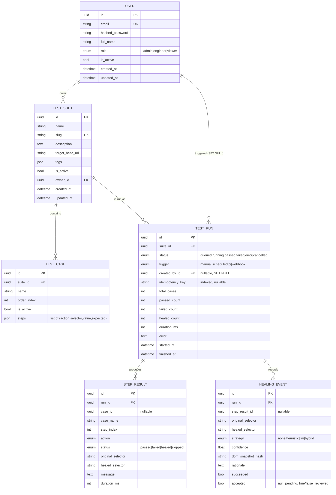

# Aegis — Architecture

Aegis is a distributed, AI-powered self-healing test-orchestration platform. It
lets teams register UI test suites, trigger runs across an async worker pool,
stream results live, and automatically recover broken UI locators when the DOM
drifts. This document explains *why* the system is shaped the way it is, then
walks through the runtime behaviours that matter operationally.

The guiding constraint is that the platform must run end-to-end with **zero
external infrastructure** (SQLite + an in-process cache) for development, tests
and demos, while scaling to Postgres + Redis + a pool of out-of-process workers
in production — *without changing a line of calling code*. That single
constraint drives most of the design decisions below.

---

## 1. Layered / hexagonal design rationale

Aegis is organised as concentric layers with dependencies pointing **inward**.
The domain core knows nothing about FastAPI, Redis or Anthropic; the outer
adapters depend on the core, never the reverse.

```
                 ┌──────────────────────────────────────────────┐
                 │                Inbound adapters                │
                 │   FastAPI routers (api/v1/*)   WebSocket   CLI │
                 └───────────────┬────────────────────────────────┘
                                 │  DTOs (domain/schemas.py)
                 ┌───────────────▼────────────────────────────────┐
                 │                Application services             │
                 │   AuthService  SuiteService  RunService         │
                 │   HealingService   (services/*)                 │
                 └───────────────┬────────────────────────────────┘
                                 │  domain models + enums
        ┌────────────────────────▼───────────────┐   ┌─────────────────────────┐
        │              Domain core                │   │     Self-healing core    │
        │  enums.py  exceptions.py  security.py    │   │  engine / strategies /   │
        │  pagination.py  resilience.py            │   │  dom  (healing/*)        │
        └────────────────────────┬───────────────┘   └────────────┬────────────┘
                                 │  repository interfaces            │
                 ┌───────────────▼────────────────────────────────▼─┐
                 │              Outbound adapters                     │
                 │  repositories/* (SQLAlchemy)   cache/redis.py      │
                 │  healing/llm.py (Anthropic)   db/session.py        │
                 │  workers/* (arq / inline dispatch)                 │
                 └────────────────────────────────────────────────────┘
```

**Why this layering pays off:**

- **Provider-agnostic core.** Services raise typed domain exceptions
  (`aegis.core.exceptions.AegisError` and friends). A *single* set of FastAPI
  exception handlers (`aegis.api.errors`) maps them to the wire envelope, so the
  same services are reusable verbatim from the Typer CLI (`aegis.cli`) and from
  the background workers, neither of which has any HTTP context.
- **Ports as Python `Protocol`s.** The healing LLM (`HealingLLM`), the run
  dispatcher (`RunDispatcher`) and the cache facade (`CacheBackend`) are all
  duck-typed seams. Swapping `ClaudeHealingLLM` ↔ `NullHealingLLM`, or
  `ArqDispatcher` ↔ `InlineDispatcher`, is a wiring decision made once in a
  factory function — never a change to a caller.
- **DTOs decoupled from ORM.** Pydantic v2 `*Create`/`*Update` schemas validate
  inbound requests; `*Read` schemas serialise ORM rows via
  `model_config = ConfigDict(from_attributes=True)`. The persistence shape can
  evolve without breaking the API contract.
- **Repositories isolate SQL.** `BaseRepository[Model]` centralises
  get/add/delete/count/list; specialised repos add the few hand-written queries
  (`UserRepository.get_by_email`, `SuiteRepository.get_with_cases`,
  `RunRepository.get_by_idempotency_key`, etc.). Services compose repositories
  and own the unit of work.

**Unit-of-work discipline.** The `get_session` dependency yields an
`AsyncSession`, rolls back on exception, and *does not auto-commit*. Each write
endpoint commits explicitly once its service work succeeds. This keeps the
"commit boundary" visible at the edge and guarantees the worker never observes a
run row that hasn't been committed (see §3).

---

## 2. Request lifecycle (HTTP)

1. **CORS + observability middleware.** Every request is stamped with a
   correlation id — taken from an inbound `X-Request-ID` header or generated —
   bound into the structured logging context, and echoed back on the response.
2. **Routing & rate limiting.** The v1 router mounts all HTTP sub-routers behind
   a `rate_limiter` dependency (the WebSocket route is exempt — it has no HTTP
   `Request`). The limiter uses a fixed-window counter in the cache, keyed by
   `rl:{client_ip}:{path}`.
3. **Authentication & RBAC.** Protected routes depend on `get_current_user`,
   which decodes the `access` JWT and loads the active `User`. Write routes add
   `require_roles(UserRole.ENGINEER)`; **admins always pass** any role check.
4. **Validation.** The request body is parsed into a Pydantic `*Create`/`*Update`
   DTO. Failures become a `422` with `code: "validation_error"`.
5. **Service work.** The route constructs a service over the session, performs
   the operation, and **commits** the unit of work.
6. **Serialisation.** The ORM result is validated into a `*Read`/`*Detail`
   schema (or wrapped in a `Page[T]` envelope for list endpoints) and returned.
7. **Telemetry on the way out.** The middleware records `aegis_http_requests_total`
   and `aegis_http_request_duration_seconds`, labelled by the **route template**
   (not the raw path) to bound metric cardinality, and emits one `http.request`
   access log line.

---

## 3. Run execution lifecycle

A *run* is the asynchronous execution of every active case in a suite. Triggering
a run and executing it are deliberately decoupled.

### Status machine

```
                    POST /suites/{id}/runs
                            │
                            ▼
                        ┌───────┐   dispatcher.enqueue(run_id)
                        │ QUEUED │ ───────────────────────────┐
                        └───┬───┘                             │
              cancel()      │   executor picks it up          │
        ┌───────────────────┤                                 ▼
        ▼                   ▼                          (inline task OR
   ┌──────────┐        ┌─────────┐                      arq worker job)
   │CANCELLED │        │ RUNNING │
   └──────────┘        └────┬────┘
                            │ all steps recorded
            ┌───────────────┼───────────────┐
            ▼               ▼               ▼
        ┌────────┐     ┌────────┐      ┌───────┐
        │ PASSED │     │ FAILED │      │ ERROR │
        └────────┘     └────────┘      └───────┘
   failed_count == 0   failed_count>0   unhandled exception
```

`RunStatus.is_terminal` is `True` for `PASSED`, `FAILED`, `ERROR`, `CANCELLED`.
`cancel()` only transitions a **non-terminal** run to `CANCELLED`.

### Dispatch: inline vs arq

`get_dispatcher()` selects the backend from configuration **once**:

- **`InlineDispatcher`** (chosen when `settings.use_fake_cache` is true, i.e. no
  `AEGIS_REDIS_URL`): runs `execute_run(run_id)` as an in-process
  `asyncio.create_task`, holding a strong reference so the task isn't GC'd
  mid-flight. Zero infrastructure — ideal for dev, tests, demos.
- **`ArqDispatcher`** (chosen when a Redis URL is configured): enqueues an
  `execute_run_task` job onto Redis. A separate pool of arq workers
  (`arq aegis.workers.arq_worker.WorkerSettings`, `max_jobs =
  worker_concurrency`) consumes the queue. This is the horizontally-scalable
  production path.

Because the API only ever calls `get_dispatcher().enqueue(run.id)` **after the
commit**, the worker can never race an uncommitted row.

### Execution (`workers/executor.py`)

`execute_run` opens its **own** DB session (it does not share the request's
session — it may run in a different process). It:

1. Loads the run; **skips** unless `status == QUEUED` (idempotent re-delivery
   safety). Loads the suite with its cases; sets `ERROR` if the suite vanished.
2. Transitions to `RUNNING`, sets `started_at`, increments the `aegis_active_runs`
   gauge, commits, and publishes a `run.started` event.
3. For each case, renders the page's *current* DOM and runs each step through the
   `SimulatedStepExecutor` — a deterministic, browser-free stand-in for
   Playwright/Selenium that exercises every real code path (DB, healing, metrics,
   events). Per step it persists a `StepResult`, flushes, and publishes a
   `step.completed` event.
4. On `finally`: sets `finished_at`, computes `duration_ms`, decrements the gauge,
   records `aegis_runs_total{status}`, `aegis_run_duration_seconds`,
   `aegis_worker_tasks_total{task,outcome}`, commits, and publishes `run.finished`.

**Simulation contract** (deterministic, no real browser):

- Stable locators (`[data-testid=…]`, class- or attribute-based) **PASS** — they
  survive DOM change.
- A locator pinned to a brittle signal (an `#id` or a pure structural path) has
  **drifted**; the healer is invoked.
- A drifted selector that still carries recoverable signal (a test-id, classes)
  **HEALS** with high confidence (`StepStatus.HEALED`). One with no signal (e.g.
  `div > div:nth-child(3)`) cannot be healed and the step **FAILS**.

A drifted step is only counted as failed when healing produces no selector; a
healed step does **not** increment `failed_count`, so a run with only healed
steps still ends `PASSED`.

### Healing-during-run sequence

```mermaid
sequenceDiagram
    autonumber
    actor Eng as Engineer
    participant API as FastAPI (runs router)
    participant Svc as RunService
    participant DB as Database
    participant Disp as Dispatcher (inline | arq)
    participant Exec as execute_run (worker)
    participant Heal as SelfHealingEngine
    participant Cache as Cache pub/sub
    participant WS as WebSocket client

    Eng->>API: POST /suites/{id}/runs (Idempotency-Key?)
    API->>Svc: create(suite_id, data, user_id, idempotency_key)
    Svc->>DB: insert TestRun (QUEUED), total_cases
    Svc-->>API: (run, created=true)
    API->>DB: COMMIT
    API->>Disp: enqueue(run.id)
    API-->>Eng: 202 Accepted (RunRead, status=queued)

    Note over WS,Cache: Eng connects WS /runs/{id}/stream?token=...
    Disp->>Exec: execute_run(run.id)  (task / job)
    Exec->>DB: load run (QUEUED) + suite with cases
    Exec->>DB: status=RUNNING, started_at
    Exec->>Cache: publish run.started
    Cache-->>WS: run.started

    loop each step
        Exec->>Exec: run_step → drifted?
        alt selector drifted
            Exec->>Heal: heal(selector, dom, context)
            Heal->>Heal: heuristic.propose(...)
            alt heuristic confidence >= min_confidence
                Heal-->>Exec: HEURISTIC proposal
            else low confidence
                Heal->>Heal: LLM.propose(...) then combine → HYBRID/best
                Heal-->>Exec: best proposal
            end
            alt healed_selector present
                Exec->>DB: HealingEvent(succeeded=true, accepted=auto?)
                Note right of Exec: status = HEALED
            else no candidate
                Exec->>DB: HealingEvent(succeeded=false)
                Note right of Exec: status = FAILED
            end
        else stable selector
            Note right of Exec: status = PASSED
        end
        Exec->>DB: insert StepResult; flush
        Exec->>Cache: publish step.completed
        Cache-->>WS: step.completed
    end

    Exec->>DB: passed/failed/healed counts; status=PASSED|FAILED
    Exec->>DB: finished_at, duration_ms; COMMIT
    Exec->>Cache: publish run.finished
    Cache-->>WS: run.finished
```

---

## 4. Data model

Enums are stored as **portable VARCHAR** (`native_enum=False`, length 32) so the
identical schema works on SQLite (local/CI) and Postgres (prod) with no native
enum migrations. All entities share `UUIDMixin` (UUID primary key) and
`TimestampMixin` (`created_at`/`updated_at`). Foreign keys cascade so deleting a
suite cleanly removes its cases, runs, results and healing events.



Notable choices:

- **`TestCase.steps` is JSON**, not a child table. Steps are an ordered,
  schema-validated value object (`StepSpec`) owned wholly by their case — storing
  them inline avoids a join-heavy model for data that is always read as a unit.
- **`TestRun.idempotency_key` is indexed and nullable** — the dedupe key for
  replayed POSTs (see §6).
- **`HealingEvent.accepted` is tri-state**: `None` = pending human review,
  `True` = accepted, `False` = rejected. The executor auto-accepts only when
  `confidence >= healing_min_confidence`; lower-confidence heals are left
  `None` to surface for review.

---

## 5. Self-healing engine design

When a locator drifts, the goal is to recover a *robust* selector for the element
the test intended to target. The engine (`healing/engine.py`) orchestrates two
pluggable strategies behind the `HealingLLM` protocol:

1. **Heuristic first** (`HeuristicHealer`, `healing/strategies.py`) — fast, free,
   deterministic, offline. It parses the DOM snapshot into candidate elements and
   scores each against the broken selector's signals. Weights sum to 1.0 and the
   most stable signal dominates:

   | Signal      | Weight |
   |-------------|--------|
   | `data-testid` | 0.60 |
   | `id`          | 0.18 |
   | visible text  | 0.10 |
   | class overlap | 0.07 (Jaccard) |
   | tag           | 0.03 |
   | other attrs   | 0.02 (`name`, `aria-label`, `placeholder`, `role`, `type`) |

   A single exact `data-testid` match (0.60) clears the default 0.6 threshold on
   its own — matching real-world locator best practice. The winning element is
   re-emitted as its most robust selector via `DomElement.to_selector()`.

2. **LLM fallback** (`ClaudeHealingLLM`) — consulted **only** when the heuristic's
   confidence is below `healing_min_confidence`. It sends the broken selector, an
   optional human description, and a truncated DOM snapshot to Claude
   (`claude-opus-4-8`) constrained to a strict JSON schema (structured outputs),
   so the response is always machine-parseable.

3. **Hybrid combination** (`_combine`): if both strategies independently agree on
   the *same* selector, the result is tagged `HYBRID` and confidence is boosted by
   `+0.1` (capped at 1.0). Otherwise the higher-confidence proposal wins; if the
   LLM returns nothing, the heuristic stands.

**Confidence threshold → human review.** `healing_min_confidence` (default `0.6`)
is the pivot for the whole engine:
- It decides whether the LLM is even consulted.
- The executor marks a heal `accepted=True` automatically when
  `confidence >= threshold`, otherwise leaves it `accepted=None` (pending review).
- Reviewers later accept/reject pending events via
  `POST /healing/{event_id}/review`.

**Graceful degradation.** With no `AEGIS_ANTHROPIC_API_KEY`, `build_llm()` returns
`NullHealingLLM` and the platform is heuristic-only with zero code changes. The
Claude call is wrapped in `with_timeout` + a `CircuitBreaker` (threshold 4), and
any failure (timeout, refusal, open circuit, parse error) logs a warning and
returns `None` — the engine simply falls back to the heuristic proposal.

---

## 6. Resilience

| Concern | Mechanism | Where |
|---------|-----------|-------|
| **Timeouts** | `with_timeout(coro, seconds=…)` maps `asyncio.TimeoutError` → `ServiceUnavailableError` (503, `code="timeout"`). The LLM call uses `healing_llm_timeout_seconds` (20s). | `core/resilience.py`, `healing/llm.py` |
| **Retries** | `retrying()` returns a tenacity `AsyncRetrying` with exponential backoff, retrying only transient errors (`ServiceUnavailableError`, `ConnectionError`, `TimeoutError`). | `core/resilience.py` |
| **Circuit breaker** | Dependency-free async `CircuitBreaker` with CLOSED → OPEN → HALF_OPEN. Trips OPEN after N consecutive failures, half-opens after `reset_timeout` (30s). The Claude client uses one (`failure_threshold=4`). | `core/resilience.py`, `healing/llm.py` |
| **Idempotency** | Clients send an `Idempotency-Key` header on `POST .../runs`. `RunService.create` checks `RunRepository.get_by_idempotency_key` first and returns the existing run with `created=False`; only newly-created runs are enqueued. | `api/deps.py`, `services/run_service.py` |
| **Rate limiting** | Per-client fixed-window counter in the cache (`CacheBackend.allow_request`), `120` requests / `60s` by default. Exceeding it raises `RateLimitedError` (429). | `api/deps.py`, `cache/redis.py` |
| **Re-delivery safety** | `execute_run` no-ops unless the run is still `QUEUED`, so a duplicated queue delivery cannot double-execute. | `workers/executor.py` |
| **Best-effort events** | Pub/sub publish failures are swallowed (`_publish`) so streaming problems never abort a run. | `workers/executor.py` |

---

## 7. Observability strategy

**RED metrics** (Prometheus, exposed at `/metrics`):

- **Rate / Errors**: `aegis_http_requests_total{method,path,status}`
- **Duration**: `aegis_http_request_duration_seconds{method,path}` (histogram)
- **Domain golden signals**: `aegis_runs_total{status}`,
  `aegis_run_duration_seconds`, `aegis_active_runs` (gauge),
  `aegis_healing_attempts_total{strategy,outcome}`, `aegis_healing_confidence`,
  `aegis_worker_tasks_total{task,outcome}`.

HTTP metrics are labelled by the **route template** (`request.scope["route"].path`)
rather than the concrete URL, keeping cardinality bounded even with UUID path
params. All metric objects live in one module (`core/metrics.py`) to avoid
duplicate-registration errors.

**Structured logs with correlation ids** (structlog). The observability
middleware generates/propagates a correlation id (`X-Request-ID`) and binds it to
the logging context, so every log line for a request is correlatable. Logs are
key/value structured and can be rendered as JSON (`AEGIS_LOG_JSON=true`) for
ingestion. Domain events use stable event names: `run.started`, `run.finished`,
`healing.result`, `circuit.open`, `dispatcher.selected`, etc.

**Distributed tracing (OpenTelemetry)** is opt-in (`AEGIS_TRACING_ENABLED=true`,
`otel` extra installed). When enabled it instruments FastAPI and SQLAlchemy and
exports OTLP spans to `AEGIS_OTLP_ENDPOINT`. The heavy OTel imports are deferred
so the base install stays lean; setup failures degrade to a warning, never a
crash.

---

## 8. Security model

- **Password hashing**: Argon2id via `passlib` (`CryptContext(schemes=["argon2"])`)
  — memory-hard, the OWASP-recommended default.
- **JWT access/refresh** (PyJWT, HS256). Tokens carry `sub` (user id), `role`,
  `type` (`access`|`refresh`), `iat`, `exp`, `jti`. The `type` claim is verified
  on decode (`decode_token(expected_type=...)`), so a refresh token can never be
  replayed as an access token. Access TTL 15 min, refresh TTL 14 days (defaults).
- **RBAC**: `UserRole{ADMIN, ENGINEER, VIEWER}`. `require_roles(*roles)` is a
  dependency factory; **admins bypass** all role checks. Read endpoints require
  only authentication; write endpoints require `ENGINEER` (or `ADMIN`).
- **WebSocket auth**: tokens can't be sent ergonomically as headers, so
  `WS /runs/{id}/stream` accepts a `?token=` query param. It is **required in
  production** and optional otherwise (close code `1008` on failure).
- **Error hygiene**: a uniform error envelope with stable machine-readable codes;
  unhandled exceptions are logged and returned as a generic `internal_error` (no
  stack traces leak to clients).
- **Config**: secrets are env-driven (`AEGIS_SECRET_KEY`, `AEGIS_ANTHROPIC_API_KEY`)
  with `extra="ignore"` so unknown env vars are tolerated.

---

## 9. Scaling & high availability

- **Stateless API.** The FastAPI app holds no per-request state beyond the DB
  session and cache connection, so it scales horizontally behind a load balancer.
  Run N replicas; readiness (`/readyz`) gates traffic.
- **Decoupled execution.** Switching `AEGIS_REDIS_URL` on flips dispatch from
  in-process to arq. Worker capacity scales independently of API capacity — add
  worker pods to drain a backlog without touching the API tier.
- **Database.** SQLite for local/CI; Postgres (`postgresql+asyncpg://…`) for
  production with `pool_size`/`max_overflow` tuning and `pool_pre_ping`. Run a
  primary with replicas; HA via managed failover.
- **Redis.** Backs the queue, rate limiter, idempotency keys and pub/sub.
  Production should use Redis with replication/Sentinel or a managed cluster.
- **Schema lifecycle.** Dev/test auto-create tables on startup
  (`create_all` for LOCAL/TEST); staging/prod apply **Alembic migrations**
  out-of-band — the app never mutates a production schema at boot.
- **Graceful shutdown.** Lifespan closes the cache and disposes the engine pool;
  in-flight inline tasks are tracked by strong reference.

---

## 10. Configuration surface

All settings are env-driven with the `AEGIS_` prefix (`core/config.py`), loaded
from environment then an optional `.env`. Defaults are chosen so the platform
boots with **no external services**:

- `database_url=sqlite+aiosqlite:///./aegis.db`
- `redis_url=""` ⇒ `use_fake_cache=True` ⇒ FakeRedis + `InlineDispatcher`
- `anthropic_api_key=""` ⇒ `NullHealingLLM` (heuristic-only healing)
- `healing_min_confidence=0.6`, `rate_limit_requests=120 / 60s`,
  `worker_concurrency=8`.

See `.env.example` for the full annotated list.
